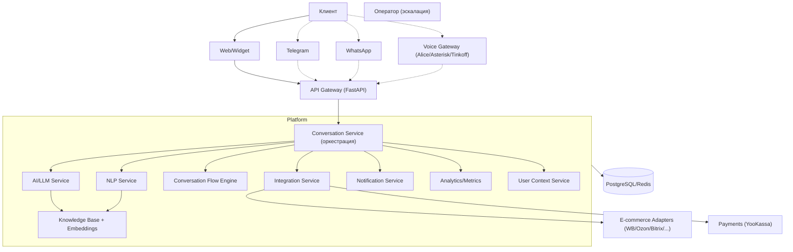
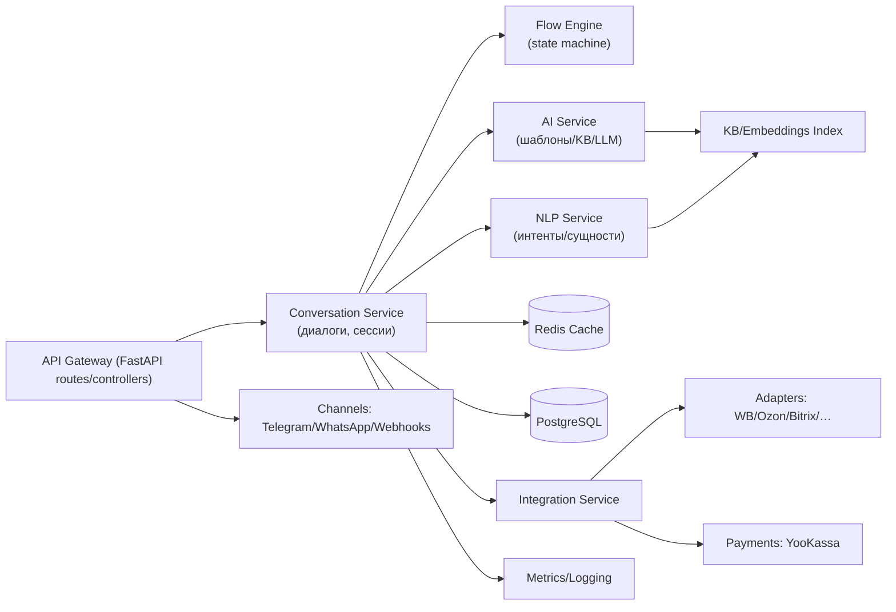
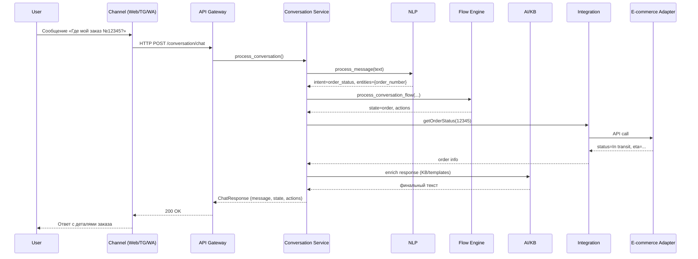

# Микросервисная архитектура платформы

Ниже — схемы контекстов, контейнеров и последовательностей для платформы (уровни C4: System/Container/Sequence). Подход к визуализации вдохновлён идеями автоматизируемой графовой визуализации архитектур ([CloudBees](https://www.cloudbees.com/blog/documenting-microservices), [Microservices Practitioner](https://articles.microservices.com/an-alternative-way-of-visualizing-microservice-architecture-837cbee575c1?gi=9a6d606207c3), [microservices.io](https://microservices.io/post/architecture/2023/01/18/omg-are-you-still-using-rational-rose.html)).

## Контекст (L1)

## Контейнеры (L2)

## Последовательность: «Статус заказа» (L3)

## Сервисные зависимости
- API ↔ Conversation: синхронный HTTP.
- Conversation ↔ (NLP/AI/Flow/Integration): синхронно, с внутренними таймаутами/ретраями.
- Integration ↔ Adapters/Payments: внешние HTTP/gRPC, требуются ретраи/ограничители.
- Хранилища: Redis (кэш), PostgreSQL (персистентность), Embeddings (в памяти/внешний векторный стор).

## Нефункциональные требования
- Наблюдаемость: метрики на вызовы, ошибки, латентность, распределение состояний.
- Надёжность: эскалация к оператору, детектор зацикливаний/длинных диалогов.
- Безопасность: секреты через ENV/Secret‑store, минимизация PII.
