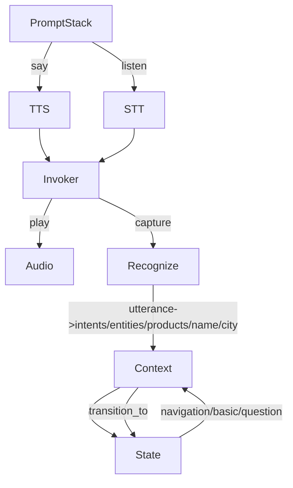
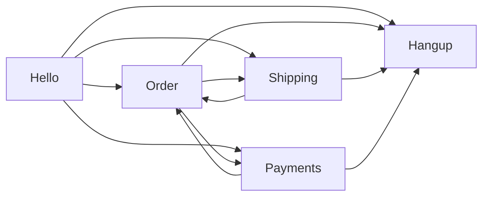
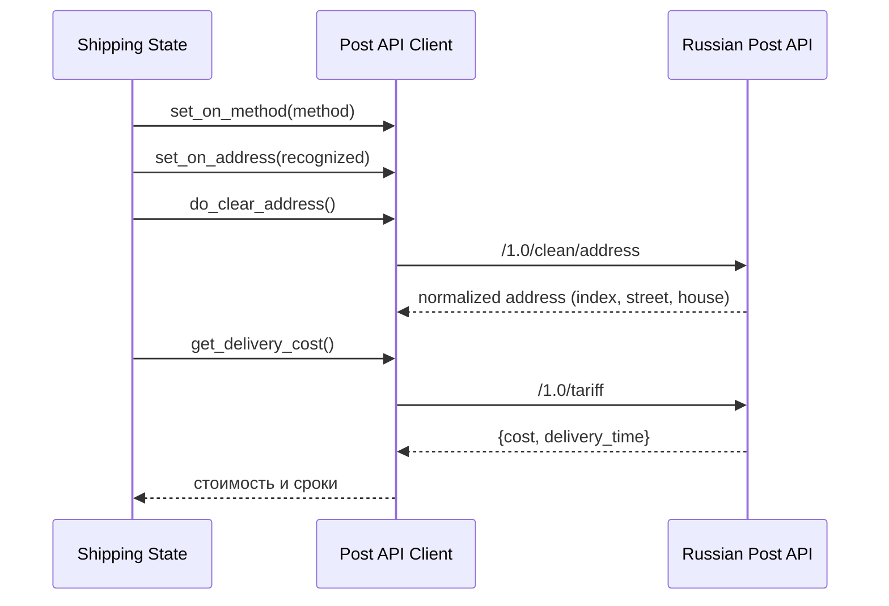

# Диаграммы для Conversation Flow Service

## Поток вызовов (TTS/STT, Recognize, States)

```mermaid
graph TD
  PS["PromptStack"] -->|say| TTS
  TTS --> Invoker
  Invoker -->|play| Audio
  PS -->|listen| STT
  STT --> Invoker
  Invoker -->|capture| Recognize
  Recognize -->|utterance->intents/entities/products/name/city| Context
  Context --> State
  State -->|navigation/basic/question| Context
  Context -->|transition_to| State
```

## Состояния (упрощённо)

```mermaid
graph LR
  Hello --> Order
  Hello --> Shipping
  Hello --> Payments
  Order --> Shipping
  Order --> Payments
  Shipping --> Order
  Payments --> Order
  Hello --> Hangup
  Order --> Hangup
  Shipping --> Hangup
  Payments --> Hangup
```

## Интеграция с Почтой России

```mermaid
sequenceDiagram
  participant S as Shipping State
  participant P as Post API Client
  participant RP as Russian Post API

  S->>P: set_on_method(method)
  S->>P: set_on_address(recognized)
  S->>P: do_clear_address()
  P->>RP: /1.0/clean/address
  RP-->>P: normalized address (index, street, house)
  S->>P: get_delivery_cost()
  P->>RP: /1.0/tariff
  RP-->>P: {cost, delivery_time}
  P-->>S: стоимость и сроки
```
